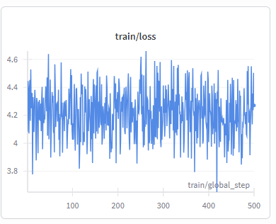

# 🚀 Voice-Trader: AI 기반 지능형 주식 주문 시스템 (Prototype)

본 프로젝트는 자연어(음성/텍스트)를 분석하여 실제 주식 매매를 수행하는 **금융 MCP(Model Context Protocol) 서버**를 구축하는 것을 목표로 합니다.

##  1. 개발 환경 및 모델 사양

* **GPU**: NVIDIA RTX 3080 (VRAM 10GB/12GB)
* **Base Model**: Qwen-2.5-7B-Instruct
* **Training Method**: QLoRA (4-bit Quantization)
* **Security**: `python-dotenv`를 이용한 API 토큰 및 환경 변수 격리 관리

##  2. 데이터셋 구성 (Dataset Configuration)

본 프로젝트의 학습 데이터는 단순 암기가 아닌 '추론'과 '확장성'을 위해 세 가지 소스를 결합하여 구성되었습니다.

1. **LLM Synthetic Data**: LLM을 활용해 생성한 다양한 구어체 주문 패턴 데이터
2. **Stock Master Data**: `kospi_code.mst` 기반의 실시간 종목 코드 데이터
3. **Text Augmentation**: AI Hub 금융 뉴스 데이터(1,099개 파일)에서 추출한 종목명과 핵심 트리거를 기존 주문 패턴에 합성하여 데이터셋 규모 및 도메인 지식 확장

##  3. 시스템 아키텍처 (Hybrid Logic)

속도와 정확도의 균형을 위해 3단계 계층 구조를 적용했습니다.

| 계층 | 기술 스택 | 역할 | 처리 속도 |
| --- | --- | --- | --- |
| **Level 1** | **Regex** | 정형화된 패턴(예: "OO 10주 사줘") 즉시 처리 | < 0.01s |
| **Level 2** | **Rapidfuzz** | 종목명 약어/오타를 마스터 파일과 대조하여 Ticker 확정 | < 0.1s |
| **Level 3** | **Fine-tuned LLM** | 비정형 문맥 및 복잡한 의도 파악 및 JSON 구조화 | ~1.0s |

##  4. 파인튜닝 성과 (Fine-tuning Metrics)

실제 학습 과정에서 수집된 핵심 지표입니다.

* **Learning Rate Optimization**: 초기 $5e-8$에서 $2e-4$로 상향 조정하여 지그재그 현상 해결 및 학습 효율 극대화
* **Optimizer**: `paged_adamw_8bit` 적용을 통해 VRAM 효율성 확보
* **Loss Convergence**: 학습 시작 후 약 60스텝 만에 **Train Loss 3.0에서 0.5 미만**으로 급격히 수렴
* **Batch Configuration**: Micro-batch size 1, Gradient accumulation 16

##  5. 향후 로드맵 (Roadmap)

1. **Smart Stock Mapper 고도화**: 우선주, ETN, 거래 정지 종목에 대한 가중치 패널티 로직 추가
2. **API Integration**: 한국투자증권 Open API 실계좌 연동 테스트
3. **Voice Interface**: STT(Speech-to-Text) 엔진 결합을 통한 음성 트레이딩 완성 - OpenAI Whisper 혹은 Qwen 자체 모델 비교 예정

##  6. 참고자료 (Reference)

1. [시각장애인을 위한 음성 명령 기반 주식 거래 시스템 설계 및 개발](https://www.dbpia.co.kr/journal/articleDetail?nodeId=NODE12093626)
1. [EDA: Easy Data Augmentation Techniques for Boosting Performance on Text Classification Tasks](https://arxiv.org/abs/1901.1119)
---
